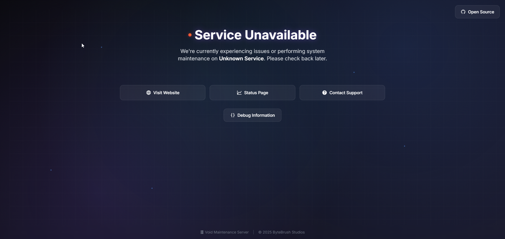
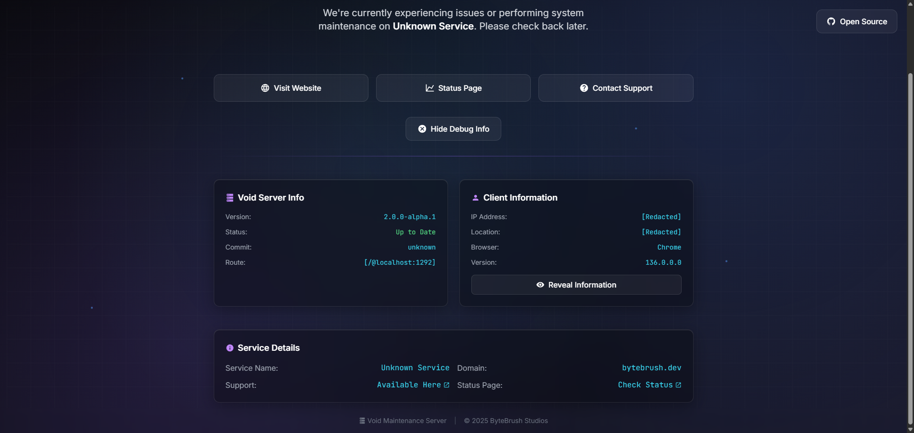

# Void ⚡

`Void` is a modern, high-performance reverse proxy and maintenance system developed by `ByteBrush Studios`. It provides intelligent traffic routing with beautiful, techy maintenance pages when services are unavailable. Built with Go for exceptional performance and featuring a stunning glassmorphic UI with animated backgrounds.

## ✨ Features

- **🔄 Intelligent Reverse Proxy**: Automatically routes traffic to healthy backends and shows maintenance pages when services are down
- **🎨 Modern UI**: Beautiful glassmorphic design with animated backgrounds and smooth transitions
- **⚡ High Performance**: Built with Go's concurrency model for lightning-fast response times
- **📱 Responsive Design**: Works flawlessly on desktop, tablet, and mobile devices
- **🛠️ Debug Information**: Built-in debugging tools with client and server information
- **🌐 Multi-Service Support**: Manage multiple services with individual configurations
- **📊 Smart API Handling**: JSON responses for API endpoints during maintenance
- **🔧 Easy Configuration**: Simple YAML-based service configuration
- **🐳 Container Ready**: Docker and Kubernetes compatible
- **🚀 Multiple Deployment Options**: Works with Nginx, Traefik, Dokploy, and more

---

## 🖼️ Preview

Experience the modern, techy interface of Void:


*Clean, modern maintenance page with glassmorphic design*

  
*Comprehensive debug information with syntax highlighting*

---

## 🚀 Quick Start

### Prerequisites
- Go 1.18 or higher (for building from source)
- OR Docker (for containerized deployment)

### Option 1: Binary Installation

1. **Download and Build**
   ```bash
   git clone https://github.com/ByteBrushStudios/void.git
   cd void
   make build
   ```

2. **Configure Services**
   ```bash
   # Copy example service configuration
   mkdir -p services
   cp examples/services/example.yaml services/myapp.yaml
   # Edit the configuration file
   ```

3. **Run Void**
   ```bash
   ./void
   ```

### Option 2: Docker Deployment

1. **Using Docker Compose**
   ```bash
   git clone https://github.com/ByteBrushStudios/void.git
   cd void
   cp examples/services.yaml.example services.yaml
   docker-compose -f examples/docker-compose.yml up -d
   ```

Void will start on port `1292` by default and begin reverse proxying to your configured services.

---

## ⚙️ Configuration

### Service Configuration

Void uses YAML configuration files in the `services` directory to define your services:

```yaml
# services/myapp.yaml
services:
  - name: "My Web Application [Production]"
    host: "http://127.0.0.1:3000"    # Backend server URL
    domain: "myapp.com"              # Domain to match requests
    support: "https://discord.gg/support"
    status: "https://status.myapp.com"
```

You can create multiple YAML files to organize your services by project or environment.

#### How It Works

1. **Healthy Service**: Void reverse proxies requests to the backend defined in `host`
2. **Unhealthy Service**: Void displays the beautiful maintenance page
3. **API Endpoints**: Services listed in `apiUrls` receive JSON responses during maintenance

#### Configuration Fields

| Field | Description | Example |
|-------|-------------|---------|
| `name` | Display name for the service | `"My App [Production]"` |
| `host` | Backend server URL for reverse proxy | `"http://127.0.0.1:3000"` |
| `domain` | Domain to match requests against | `"myapp.com"` |
| `support` | Support/contact URL | `"https://discord.gg/support"` |
| `status` | Status page URL | `"https://status.myapp.com"` |

---

## 🌐 Deployment Options

### Nginx Integration

Perfect for traditional server setups. Void acts as a fallback when your main services are down.

```bash
# Copy the example configuration
cp examples/nginx.conf /etc/nginx/sites-available/your-site
# Edit and enable the configuration
sudo nginx -t && sudo systemctl reload nginx
```

See `examples/nginx.conf` for a complete production-ready configuration.

### Traefik Integration

Ideal for containerized environments with automatic service discovery.

```bash
# Copy Traefik configuration
cp examples/traefik.yml /etc/traefik/
# Void integrates seamlessly with Traefik's circuit breaker middleware
```

### Dokploy Deployment

Modern deployment platform with built-in container orchestration.

```bash
# Import the Dokploy configuration
dokploy import examples/dokploy.json
# Deploy with zero-downtime rolling updates
```

### Systemd Service

For production server deployments:

```bash
# Copy service file
sudo cp examples/void.service /etc/systemd/system/
# Enable and start
sudo systemctl daemon-reload
sudo systemctl enable void.service
sudo systemctl start void.service
```

---

## 🔧 Environment Variables

| Variable | Description | Default |
|----------|-------------|---------|
| `VOID_PORT` | Server port | `1292` |
| `VOID_LOG_LEVEL` | Log level (debug, info, warn, error) | `info` |

---

## 📊 Architecture

```
┌─────────────────┐    ┌─────────────────┐    ┌─────────────────┐
│   Load Balancer │────│      Void       │────│  Backend Apps   │
│  (Nginx/Traefik)│    │ Reverse Proxy   │    │ (Your Services) │
└─────────────────┘    └─────────────────┘    └─────────────────┘
                              │
                              ▼
                      ┌─────────────────┐
                      │ Maintenance UI  │
                      │ (When backend   │
                      │  is unhealthy)  │
                      └─────────────────┘
```

### Request Flow

1. **Incoming Request** → Load balancer routes to Void
2. **Domain Matching** → Void matches request domain to configured service
3. **Health Check** → Void attempts to proxy to backend service
4. **Success** → Request proxied to healthy backend
5. **Failure** → Beautiful maintenance page served (HTML) or JSON response (APIs)

---

## 🔍 Features Deep Dive

### Intelligent Reverse Proxy
- **Automatic Failover**: Seamlessly switches between backend and maintenance mode
- **Domain-Based Routing**: Route different domains to different backend services
- **Health Detection**: Automatically detects when services are available again
- **Header Preservation**: Maintains original request headers for proper backend handling

### Smart API Handling
```yaml
apiUrls:
  - "api.example.com"
  - "webhooks.example.com"
```
API endpoints receive structured JSON responses instead of HTML:
```json
{
  "message": "This service is down for maintenance...",
  "service": {
    "name": "API Server [Production]",
    "domain": "api.example.com",
    "support": "https://support.example.com",
    "status": "https://status.example.com"
  },
  "info": {
    "version": "2.0.0-alpha.1",
    "commit": "abc123"
  }
}
```

### Debug Information
The debug panel provides comprehensive diagnostics:
- **Server Info**: Void version, commit hash, routing details
- **Client Info**: IP address, geolocation, browser details with privacy controls
- **Request Details**: Path, hostname, and routing information

### Modern UI Features
- **Animated Background**: Subtle particle animations and grid patterns
- **Glassmorphic Design**: Modern blur effects and transparency
- **Smooth Transitions**: Buttery smooth animations and micro-interactions
- **Responsive Layout**: Perfect on all screen sizes and devices
- **Dark Theme**: Modern color palette optimized for readability

---

## 🛠️ Development

### Project Structure

```
void/
├── main.go                    # Main application entry point
├── services.yaml             # Service configuration
├── app.html                  # Modern maintenance page template
├── assets/                   # Static assets (images, icons)
│   └── previews/            # UI preview images
├── state/                   # Application state management
├── types/                   # Type definitions and structs
├── examples/                # Configuration examples
│   ├── nginx.conf          # Nginx integration example
│   ├── traefik.yml         # Traefik configuration
│   ├── dokploy.json        # Dokploy deployment config
│   ├── void.service        # Systemd service template
│   ├── docker-compose.yml  # Docker Compose setup
│   └── services.yaml.example # Service configuration example
├── temp/                   # Temporary files and drafts
└── README.md               # This documentation
```

### Building from Source

```bash
# Install dependencies and build
make build

# Run in development mode with hot reload
make dev

# Run tests
make test

# Build for production with optimizations
make release
```

### API Endpoints

| Endpoint | Description |
|----------|-------------|
| `/*` | Main router - handles all requests with domain matching |
| `/__voidStatic/*` | Static assets (CSS, JS, images) |

---

## 🔧 Advanced Configuration

### Load Balancing Integration

Void works excellently behind load balancers:

**HAProxy Example:**
```haproxy
backend void_maintenance
    server void1 127.0.0.1:1292 check

backend app_servers
    option httpchk GET /health
    server app1 127.0.0.1:3000 check fall 3 rise 2
    server app2 127.0.0.1:3001 check fall 3 rise 2

frontend web_frontend
    default_backend app_servers
    # Fallback to maintenance on 5xx errors
    errorfile 503 /dev/null
    errorloc 503 http://void-maintenance:1292
```

### Container Orchestration

**Kubernetes Example:**
```yaml
apiVersion: apps/v1
kind: Deployment
metadata:
  name: void-maintenance
spec:
  replicas: 2
  selector:
    matchLabels:
      app: void
  template:
    metadata:
      labels:
        app: void
    spec:
      containers:
      - name: void
        image: void:latest
        ports:
        - containerPort: 1292
        env:
        - name: VOID_PORT
          value: "1292"
        - name: VOID_LOG_LEVEL
          value: "info"
```

---

## 🤝 Contributing

We welcome contributions! Here's how to get started:

1. **Fork & Clone**
   ```bash
   git clone https://github.com/your-username/void.git
   cd void
   ```

2. **Create Feature Branch**
   ```bash
   git checkout -b feature/amazing-feature
   ```

3. **Make Changes & Test**
   ```bash
   make test
   make dev  # Test your changes
   ```

4. **Commit & Push**
   ```bash
   git commit -m "feat: add amazing feature"
   git push origin feature/amazing-feature
   ```

5. **Open Pull Request**

### Development Guidelines
- Follow Go best practices and `gofmt` formatting
- Add tests for new features
- Update documentation for any API changes
- Ensure backwards compatibility
- Test with multiple deployment scenarios

---

## 📄 License

This project is licensed under the **MIT License** - see the [LICENSE](LICENSE) file for details.

### Open Source Credits
- [Go](https://golang.org/) - The Go Programming Language
- [Chi Router](https://github.com/go-chi/chi) - Lightweight HTTP router
- [Tailwind CSS](https://tailwindcss.com/) - Utility-first CSS framework
- [Iconify](https://iconify.design/) - Unified icon framework
- [ipapi.co](https://ipapi.co/) - IP geolocation API

---

## 🆘 Support & Community

- **📚 Documentation**: This README and inline code comments
- **🐛 Issues**: [GitHub Issues](https://github.com/ByteBrushStudios/void/issues)
- **💬 Discussions**: [GitHub Discussions](https://github.com/ByteBrushStudios/void/discussions)
- **💬 Discord**: Join our [community](https://discord.gg/Vv2bdC44Ge)
- **📧 Email**: [hey@bytebrush.dev](mailto:hey@bytebrush.dev)

---

## 🏢 About ByteBrush Studios!

Void is developed and maintained by [ByteBrush Studios](https://bytebrush.dev), creators of high-quality open-source software for developers and businesses.

**Other Projects:**
- [Infinity Bot List](https://infinitybots.gg/) - The next generation Discord bot list
- [Eureka](https://github.com/infinitybotlist/eureka) - Powerful logging and utilities library

---

<div align="center">

**[⭐ Star this repo](https://github.com/ByteBrushStudios/void) • [🐛 Report Bug](https://github.com/ByteBrushStudios/void/issues) • [💡 Request Feature](https://github.com/ByteBrushStudios/void/discussions)**

Made with ❤️ by ByteBrush Studios

</div>
